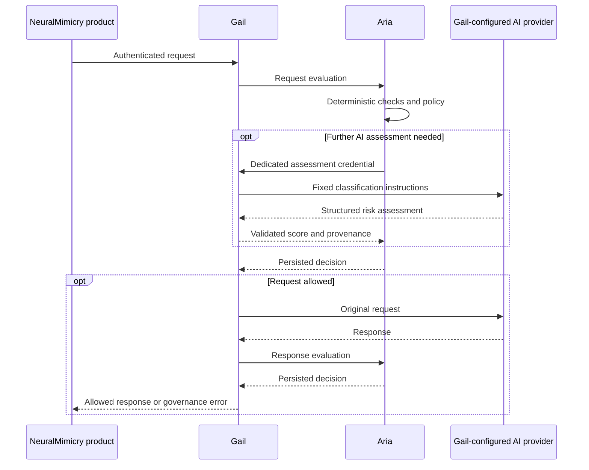

# Aria

**Aria — Automated Regulation & Integrity Arbiter** is NeuralMimicry’s AI governance service for Gail. It assesses requests and responses, identifies risk, records decisions, alerts operators and applies runtime policy before Gail releases content.

Aria’s AI capability comes entirely from Gail’s configured providers. Neither project imports the other. A versioned HTTP contract and a restricted assessment route prevent recursive governance checks.



## Capabilities

- Deterministic checks for instruction overrides, credential patterns, destructive commands and harmful instructions, supported by contextual AI assessment through Gail.
- Versioned thresholds, per-source blocking, a global pause, body-size limits and explicit treatment of unavailable AI or uninspectable content.
- Request and response enforcement, including Gail’s in-process completion callers. Streamed HTTP responses are buffered within a strict limit and checked before release.
- Concurrent asynchronous evaluations with bounded admission, deadlines, pooled connections and graceful shutdown.
- Persistent decisions, idempotent retries, operator attribution and policy history. Alert delivery uses a transactional outbox, signed webhooks, bounded parallel delivery and retries.
- A responsive dashboard with incident acknowledgement, policy management, source filtering, JSON export, operational health and links to existing products.
- PostgreSQL for shared state across replicas; SQLite for a single local instance. No external frontend build system is required.

## Run locally

Aria requires Rust 1.92 or newer for the supplied container toolchain. The neighbouring Gail checkout currently requires Rust 1.95 or newer; `cargo +stable` can use a suitable installed toolchain.

```bash
python3 scripts/configure-local.py
source config/local.env
cargo run --locked
```

The service listens on `http://127.0.0.1:8091`. Open that address and enter the operator or viewer token from the private `config/local.env` file. Tokens stay in browser memory and are cleared on disconnect or reload.

Merge the `governance` object from `config/gail-governance.local.json` into your **local Gail configuration**, retaining its existing provider and security settings. Gail accepts JSON as YAML. Start the updated Gail binary with that configuration:

```bash
cd ../gail
cargo +stable run --no-default-features --bin gail -- --config /path/to/local-gail.yaml
```

The generated overlay uses Gail at port 8080 and Aria at port 8091. Change `ARIA_GAIL_URL` and the overlay’s `aria_url` when using different addresses. The assessment token must match `ARIA_GAIL_TOKEN`; the evaluation token must match the evaluator entry in `ARIA_TOKENS`. They must differ from each other and from ordinary Gail API tokens.

Initial policy enables AI assessment and blocks traffic when it cannot obtain a valid assessment. Gail needs a healthy, configured provider capable of returning the classifier’s JSON contract. Select **monitor** mode in Gail for an observation-only rollout; select **enforce** to apply Aria’s blocks and pauses.

## Configuration

| Environment variable | Default / purpose |
|---|---|
| `ARIA_BIND` | `127.0.0.1:8091` |
| `ARIA_DATABASE_URL` | `sqlite://aria.db?mode=rwc`; PostgreSQL URLs are also supported |
| `ARIA_TOKENS` | Required JSON array of `{principal, role, token}`; roles are `evaluator`, `viewer`, `operator` |
| `ARIA_GAIL_URL` | `http://127.0.0.1:8080` |
| `ARIA_GAIL_TOKEN` | Required dedicated Gail assessment credential |
| `ARIA_AI_TIMEOUT_MS` | `15000`; must exceed Gail’s assessment timeout |
| `ARIA_MAX_IN_FLIGHT` | `32` concurrent evaluations per instance |
| `ARIA_WEBHOOK_URL` | Optional operator-controlled alert receiver |
| `ARIA_WEBHOOK_SECRET` | Signing secret, required with a webhook URL |
| `ARIA_PRODUCTS` | Optional JSON array of `{name, url}` replacing the supplied product links |
| `RUST_LOG` | `aria=info` |

API and signing secrets require at least 32 characters. Use distinct credentials per operator in production for individual attribution. Use TLS or an authenticated private network between services; outbound redirects are disabled. Database access and query errors are not returned to clients.

## Integration and deployment

The companion changes register Aria in the Customers service catalogue with no public access, add navigation from Conductor, and configure authenticated Prometheus scraping. Existing products that already call Gail gain governance through the gateway. Product links are deployment-configurable; Aria does not read billing records or grant itself product administration rights.

The deployment changes are under `../../swarmhpc/swarmhpc/ansible/`:

- `continuum_tenant_aria_site.yml` deploys Aria with persistent storage, probes, a restricted container, TLS ingress and DNS registration through the existing tenant role.
- `continuum_governance_site.yml` deploys Aria, enables Gail enforcement and adds Aria to Prometheus. Both application images must contain these changes.
- `aria_credentials` creates separate, persistent credentials under `.secrets/aria/<inventory-host>/` on the Ansible controller. Explicit environment or inventory credentials override generated values. Use the same overrides for subsequent playbook runs.

Build and publish an appropriately versioned Aria image through your usual release process:

```bash
podman build -f Containerfile -t ghcr.io/neuralmimicry/aria:<version> .
```

Then, with the updated Gail image available, run from the Ansible directory:

```bash
ansible-playbook -i inventory/hosts.ini continuum_governance_site.yml \
  -e continuum_tenant_aria_image=ghcr.io/neuralmimicry/aria:<version> \
  -e continuum_tenant_gail_image=ghcr.io/neuralmimicry/gail:<version>
```

The default Aria deployment uses one SQLite replica and a PVC. For multiple replicas, supply a shared PostgreSQL database and set `continuum_tenant_aria_replicas`; policy updates and alert claims coordinate through SQL. Do not run multiple SQLite replicas or use SQLite on a filesystem without reliable locking. Database migrations run under a PostgreSQL advisory lock. Apply your normal database backup, access-control and retention procedures; automatic deletion of audit evidence is deliberately absent.

See [the API contract](docs/api.md) and [operational guidance](docs/operations.md) for coverage, failure behaviour and alert verification.

## Validation

```bash
cargo fmt --check
cargo clippy --locked --all-targets -- -D warnings
cargo test --locked
# Optional: repeat the integration suite against an isolated PostgreSQL database.
ARIA_TEST_DATABASE_URL=postgres://localhost/aria_test cargo test --test governance
node --check assets/dashboard.js
python3 scripts/check_deployment.py
```

For a complete local round trip, build both binaries and run `python3 scripts/smoke.py`. It starts real Aria and Gail services with temporary state and a local mock AI provider, then verifies AI assessment, request blocking, response withholding and credential isolation. With Playwright installed, `python3 scripts/smoke.py --browser` also checks dashboard login, policy changes, acknowledgement and mobile layout. These tests do not contact live AI providers.

Aria identifies risk; it does not establish intent or guarantee detection of every harmful request. Its supplied rules are conservative starting points and can flag benign discussion. Assess model behaviour and thresholds using representative workload examples before adopting production enforcement. Aria is a governance component, not a certification of regulatory compliance.
